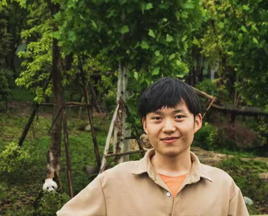

** Ding Luo  &nbsp;  罗钉 **

> <i class="fas fa-at"></i> &nbsp; luoding AT stu DOT xmu DOT edu DOT cn \\
> <i class="fas fa-link"></i> &nbsp; 
[<i class="fas fa-graduation-cap"></i> Google Scholar](https://scholar.google.com/citations?user=BlQHxToAAAAJ),
<!-- [<i class="fas fa-graduation-cap"></i> Semantic Scholar](https://www.semanticscholar.org/author/Yutong-Xie/3956514), -->
<!-- [<i class="fab fa-linkedin-in"></i> LinkedIn](https://www.linkedin.com/in/yutxie),
[<i class="fab fa-twitter"></i> Twitter](https://twitter.com/yutxie), -->
[<i class="fab fa-github"></i> Github](https://github.com/ld139)

I am a thrid-year Ph.D. candidate at the [Xiamen University](https://www.xmu.edu.cn/) [College of Chemistry and Chemical Engineering](https://chem.xmu.edu.cn/), advised by [Prof. Binju Wang](https://chem.xmu.edu.cn/info/1421/7656.htm). 
<!-- Prior to this, I received my Bachelor's degree and Master degree from [Shaanxi University of Science and Technology](https://www.sust.edu.cn/), advised by [Prof. Jianbo Tong](https://hg.sust.edu.cn/info/1236/5604.htm). -->
<!-- I'm looking for tenure-track and postdoctoral positions that start Fall 2026! If my research aligns with your interest or you know of any relevant opportunities, I would be more than happy to get in touch :). Please find my [**CV here**](https://drive.google.com/file/d/17HsrAQy3KGlnQOSLAHNBNzqU2rVOJ3hI/view?usp=sharing).  -->

---

## RESEARCH

My current research focuses on  leveraging ​​AI and computational approaches​​ to address specific challenges in chemistry and biology that are difficult to resolve through conventional experimental methods. 
Key applications include::
<ul style="margin-top: -20px;margin-bottom: -10px;">
<li>Applying ​​deep learning to enzyme design, engineering, and discovery​ [<a href="https://www.biorxiv.org/content/10.1101/2025.05.18.654694v1">Biorxiv'25</a>, <a href="https://doi.org/10.34133/bdr.0048">BDR'2024</a>]; </li>
<li>Developing deep learning models to characterize protein-ligand interactions​ [<a href="https://doi.org/10.1021/acs.jcim.3c01961">JCIM'25</a>, <a href="https://doi.org/10.1021/acs.jctc.4c00653">JCTC'24</a>, <a href="https://doi.org/10.1021/acs.jctc.4c01636">JCTC'25</a>] </li>
<!-- <li>Aligning AI with human behaviors, objectives, and values. </li> -->
<!-- <li>Foundation models for human behaviors (<a href="https://arxiv.org/abs/2505.23058">Be.FM</a>) [<a href="">arXiv'25</a>]. </li> -->
</ul>
<!-- 
 -->

In addition, I also have a general interest in: 
<ul style="margin-top: -20px;margin-bottom: 15px;">
<li><a href="#Molecular simulations"><em>Molecular simulations</em></a>
[<a href="https://doi.org/10.1016/j.molstruc.2021.131378/">J. Mol. Struct'22</a>, 
<a href="https://doi.org/10.1080/10406638.2021.1973519">Polycycl. Aromat. Comp'21</a>,
<a href="https://doi.org/10.1080/1062936x.2021.1999317">SAR QSAR Environ. Res'21</a>, 
<a href="https://doi.org/10.1016/j.molliq.2021.116235">J. Mol. Liq.'21</a>]; </li>
</ul>

<!-- For undergraduate and master students who find my research interesting and would like to work with me, please feel free to reach out! -->

---

## SELECTED PUBLICATIONS

[AI for enzyme](#ai-for-science) / [Molecular simulations](#moleular-simulations) / [Other Topics](#other-topics) / [All Publications (Google Scholar)](https://scholar.google.com/citations?user=BlQHxToAAAAJ)

#### AI for Science

1. [**Catalytic pocket-informed augmentation of enzyme kinetic parameters prediction via hierarchical graph learning**](https://www.biorxiv.org/content/10.1101/2025.05.18.654694v1) \\
**Ding Luo**, Xiaoyang Qu, Binju Wang\*.
[[PDF](https://www.biorxiv.org/content/10.1101/2025.05.18.654694v1.full.pdf)\]
[[BiorXiv](https://doi.org/10.1101/2025.05.18.654694)\]
[[Code](https://github.com/ld139/GraphKcat)\] 

1. [**Ligand-Conditioned Side Chain Packing for Flexible Molecular Docking**](https://doi.org/10.1021/acs.jctc.4c01636) \\
**Ding Luo**, Xiaoyang Qu, Dexin Lu, Yiqiu Wang, Lina Dong, Binju Wang\*. \\
J. Chem. Theory Comput. 2025, 21, 3, 1494–1505. \\
[[PDF](https://www.biorxiv.org/content/10.1101/2024.11.22.624942v1.full.pdf)\]
[[BiorXiv](https://www.biorxiv.org/content/10.1101/2024.11.22.624942v1)\]
<!-- [[Code]()\] -->
[[Code](https://github.com/ld139/ApoDock_public)\] 

1. [**Enhancing Generalizability in Protein–Ligand Binding Affinity Prediction with Multimodal Contrastive Learning**](https://doi.org/10.1021/acs.jcim.3c01961) \\
**Ding Luo**, Dandan Liu, Xiaoyang Qu, Lina Dong, Binju Wang\*. \\
J. Chem. Inf. Model. 2024, 64, 6, 1892–1906.  \\
[[PDF](https://pubs.acs.org/doi/pdf/10.1021/acs.jcim.3c01961?ref=article_openPDF)\]
[[Code](https://github.com/ld139/ConBAP)\] 

1. [**A Robust Induced Fit Docking Approach with the Combination of the Hybrid All-Atom/United-Atom/Coarse-Grained Model and Simulated Annealing**](https://doi.org/10.1021/acs.jctc.4c00653) \\
Dexin Lu，**Ding Luo**，Yuwei Zhang*，Binju Wang\*. \\
J. Chem. Theory Comput. 2024, 20, 14, 6414–6423.  \\
[[PDF](https://pubs.acs.org/doi/pdf/10.1021/acs.jctc.4c00653?ref=article_openPDF)\]

#### Moleular simulations

1. [**Computational strategies towards developing novel SARS-CoV-2 Mpro inhibitors against COVID-19**](https://doi.org/10.1016/j.molstruc.2021.131378) \\
**Ding Luo**, Jian-Bo Tong\*, Xing Zhang, Xue-Chun Xiao, Shuai Bian. \\
J. Mol. Struct. 2022, 1247, 131378. \\
[[PDF](https://www.sciencedirect.com/science/article/pii/S0022286021015064?via%3Dihub)\]

1. [**Theoretically exploring selective-binding mechanisms of BRD4 through integrative computational approaches**](https://doi.org/10.1080/1062936x.2021.1999317) \\
**Ding Luo**, Jian-Bo Tong\*, Xuechun Xiao, Shuai Bian, Xing Zhang, Jie Wang, Hai-Yin Xu. \\
SAR QSAR Environ. Res. 2021, 32, 12, 985-1011. \\
[[PDF](https://www.tandfonline.com/doi/epdf/10.1080/1062936X.2021.1999317?needAccess=true)\]

1. [**3D-QSAR and Molecular Docking Analysis for Natural Aurone Derivatives as Anti-Malarial Agents**](https://doi.org/10.1080/10406638.2021.1973519) \\
**Ding Luo**, Jian-Bo Tong\*, Yi Feng. \\
Polycycl. Aromat. Comp. 2021, 42,6017-6032. \\
<!-- AI for Science Workshop at ICML, 2022. \\ -->
[[PDF](https://www.tandfonline.com/doi/epdf/10.1080/10406638.2021.1973519?needAccess=true)\] 

#### Other Topics

1. [**Biosynthesis of Diverse Ephedra-Type Alkaloids via a Newly Identified Enzymatic Cascade**](http://dx.doi.org/10.34133/bdr.00482) \\
Peiling Wu, **Ding Luo**, Xiaoxu Shang, Binju Wang, Xianming Deng, Jifeng Yuan\* \\
Biodesign res, 2024, 6, 0048. \\
[[PDF](http://dx.doi.org/10.34133/bdr.00482)\]
<!-- [[Poster]()\] -->

1. [**Mechanistic effects of solvent systems on the Ni–Sn-catalyzed hydrodeoxygenation of lignin derivatives to none-oxygenates**](https://doi.org/10.1039/d1cy01965a) \\
Han He; **Ding Luo**, Hao Ma, Shuqian Xia\*.\\
Catal. Sci. Technol, 2022,12, 154-166. \\
[[PDF](https://pubs.rsc.org/en/content/articlepdf/2022/cy/d1cy01965a)\]

1. [**Steering oxygen-centred radicals with ground-state ene-reductases for enantioselective intermolecular hydroalkoxylations**](https://doi.org/10.1038/s41929-025-01372-z) \\
Bin Chen, Qiaoyu Zhang, Jinhai Yu, Beibei Zhao, Ran Ge, Zihan Zhang, **Ding Luo**, Binju Wang\*, Xiaoqiang Huang\*.\\
Nat Catal, 2025. \\
[[PDF](https://www.nature.com/articles/s41929-025-01372-z.pdf)\]

\* = corresponding author

Last updated: July, 2025  